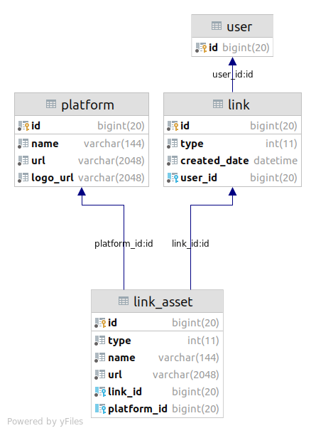

# LinkTreeBackend

This is an implementation for the Backend challenge, with the following problem description:

## Problem Description
We have three new link types for our users.

1. Classic
    - Titles can be no longer than 144 characters.
    - Some URLs will contain query parameters, some will not.
2. Shows List
    - One show will be sold out.
    - One show is not yet on sale.
    - The rest of the shows are on sale.
3. Music Player
    - Clients will need to link off to each individual platform.
    - Clients will embed audio players from each individual platform.

## Solution Schema

The problem spec specified not to connect to a "real world database" and so the submitted application does not connect to any database. The storage layer has been mocked with the implementation in `db_mock.go`, which stores the
data in a series of maps. However, the structs defined `db/repository` work to the same relationships in the database design below. 

_This means the application can be run and tested without setting up any database_. I did however, include MySQL scripts to demonstrate how a MySQL database would be structured for this.

The `db/migrations` directory contains MySQL scripts that describe the database structure. This can be summarised with the following Goland generated Schema:



### Schema Explanation

The problem spec gave the above link examples, but stated that these are 3 out of hundreds of potential link types. So the schema is designed to be flexible,
in terms of the information that a link can represent, to make sure it's not boxed in to just the 3 given link types. But there are still some further assumptions
that I made to constrain the design.

Assumptions:
1. Every possible link type is a collection of web resources that are either redirects the viewer somewhere to is an embedded resource (i.e in an iframe). An as such a link may contain any amount of resources, which may be urls for a song/album/playlist for a specific platform that are to be displayed in an iframe. Or links to events, products, affiliate links etc.
2. We won't be storing too much data about the resource that we are displaying, i.e we don't care about the title, etc of a song as the embedded resource will take care of that.
3. The second assumption was made to keep the implementation doable in the amount of time, however the design can be extended to include more metadata about the resource. (i.e it appears like shows list requires us to store whether the show is for sale or sold out).
4. Music and Shows does not have a configurable top level link title
5. A user has only 1 landing page (to simplify task)

The schema is made up of the following tables, which are explained conceptually:
Link - This represents a single link type e.g classic, music, shows.
Link_asset - This represents multiple resources that a link may have (such as multiple music players and platforms or shows)
Platform - This is for embedded link types which link back to a platform information record, such as the platforms webpage etc.
User - The user who has 1 landing page made up of links.

## Summary of TODOs

- Expand the schema to support any type of additional data about a resource, i.e for shows we want to store date, address, status etc (although ideally this would be an integration type resource, explained below).
- Improve validation to ensure that the abstract data design cannot be used to store incomplete link types, which would break the client.
- Implement Integration type resources, which unlike embedded or classic resources, allows the api to query an external endpoint to get up to date data about something that cannot be embedded. (I.e we should not directly store whether a show is sold out as this could change any time without this API knowing).
- Improve ordering to allow client to specify direction (ascending or descending).
- User is currently hardcoded to only 1 existing user, this needs to be changed to allow userid to be retrieved out of a JWT token (as an example).
- Request/Response currently use ints to represent enum for Type, this needs to be fixed to include mapping to and from string desc.
- Move name (title) under link instead of link_asset.
- Add API tests and unit tests

## Setup

This is a go modules based Golang application and requires a go version of at least 1.16. The application can be compiled with:

`go build main.go`

or directly run with:

`go run main.go`

## Endpoints 

GET links endpoint:

```
GET /links?orderByDate=false
```

This endpoint will get a links for a specified user (Currently only 1 hardcoded user for every request there is TODO for this).

Example Response for music resource.

```
{
    "id": 4,
    "type": 0,
    "createdDate": "2021-07-04T19:19:56.059245772+12:00",
    "linkAssets": [
        {
            "ID": 5,
            "type": 1,
            "name": "Song A",
            "url": "https://open.spotify.com/track/269OfNY9Je1QWaDnu31KKp?si=68e7296d03184662",
            "platform": {
                "id": 1,
                "name": "Spotify",
                "url": "https://www.spotify.com/",
                "logoUrl": "https://www.spotify.com/logo.png"
            }
        }
    ]
}
```

Example for classic resource:

```
{
    "id": 4,
    "type": 0,
    "createdDate": "2021-07-04T19:19:56.059245772+12:00",
    "linkAssets": [
        {
            "ID": 5,
            "type": 0,
            "name": "Classic link",
            "url": "https://classic.com/test",
            "platform": null
        }
    ]
}
```

POST link endpoint:

```
POST /links
```
 Example request body:
 
```
{
    "type": 0,
    "linkAssets": [
        {
            "type": 0,
            "name": "test github classic link",
            "url": "https://github.com/jdebes"
        }
    ]
}
```